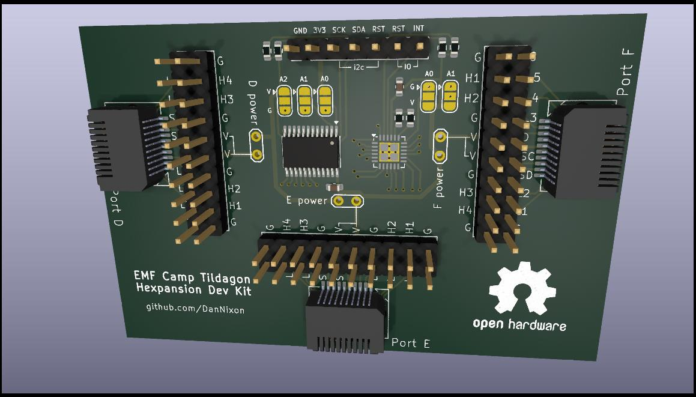

# Tildagon Hexpansion dev kit

A basic, quick and dirty development kit for hexpansions for the [Tildagon](https://tildagon.badge.emfcamp.org/) badge.

Accurately replicates i2c and low speed IO/LED drivers of ports D, E and F from the actual badge, with breakouts for the entire expansion port.
i2c is as per the actual badge, with the AW9523B connected to port 7 of the TCA9548A.
Default address configuration of both the AW9523B and TCA9548A match what is used on the badge (so you should not have to adjust the solder jumpers).

Paired with your ESP32-S3 dev board of choice, this should allow you to develop something more than "shape with LED" hexpansions prior to EMF 2024.

## See also

- [badge-2024-hardware](https://github.com/emfcamp/badge-2024-hardware)
- [TCA9548A datasheet](https://www.ti.com/lit/ds/symlink/tca9548a.pdf)
- [AW9523B datasheet](https://cdn-shop.adafruit.com/product-files/4886/AW9523+English+Datasheet.pdf)
- [Hexpansion developer guide](https://tildagon.badge.emfcamp.org/technical-reference/hexpansions/)
